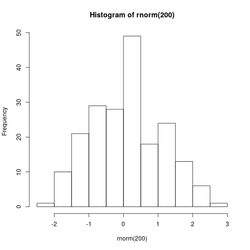

Introduction
========================================================
author: 
date: 
autosize: true

History
========================================================

- S language was developed at Bell laboratory by John Chambers
- The S philosophy:
    “[W]e wanted users to be able to begin in an interactive environment, where they did not consciously think of themselves as programming. Then as their needs became clearer and their sophistication increased, they should be able to slide gradually into programming, when the language and system aspects would become more important.”
- S was available only through S plus commercial software

History
========================================================

- In 1991, R was created by Ross Ihaka and Robert Gentleman in the Department of Statistics at the University of Auckland
- IN 1995 it was made a free software with GNU licence. 


R today
========================================================

- Has evolved a lot since the initiation as S
- From academics to industry everyone is using and developing R
- The inbuilt statistical methods in R makes life easy when doing data analysis
- The visualization library in R is quite powerful
- With Rstudio it is very easy to use R 


What are people doing with R ? 
========================================================

- Any kind of data analysis
- Learn statistics with R

```r
hist(rnorm(200))
```


- Building predictive algoritms
- Spatial analysis
- Writing books
- Writing blogs
- Making computer generated art
- Making dashboards
- Making apps


What do yu want to do with R? 
========================================================

-


