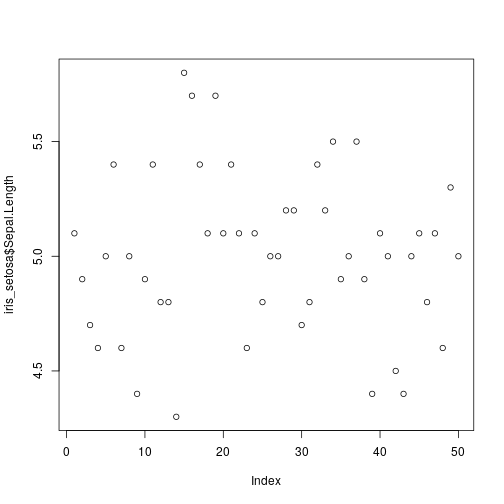
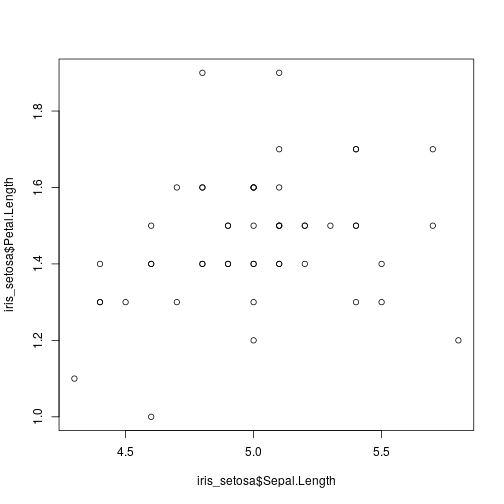

```r
# get iris data
df_iris<-datasets::iris

# check dimensions

rows<-dim(df_iris)[1]
cols<-dim(df_iris)[2]

# what are the columns

colnames(df_iris)[1]
```

```
## [1] "Sepal.Length"
```

```r
# class of each column

df_iris[ ,1]
```

```
##   [1] 5.1 4.9 4.7 4.6 5.0 5.4 4.6 5.0 4.4 4.9 5.4 4.8 4.8 4.3 5.8 5.7 5.4
##  [18] 5.1 5.7 5.1 5.4 5.1 4.6 5.1 4.8 5.0 5.0 5.2 5.2 4.7 4.8 5.4 5.2 5.5
##  [35] 4.9 5.0 5.5 4.9 4.4 5.1 5.0 4.5 4.4 5.0 5.1 4.8 5.1 4.6 5.3 5.0 7.0
##  [52] 6.4 6.9 5.5 6.5 5.7 6.3 4.9 6.6 5.2 5.0 5.9 6.0 6.1 5.6 6.7 5.6 5.8
##  [69] 6.2 5.6 5.9 6.1 6.3 6.1 6.4 6.6 6.8 6.7 6.0 5.7 5.5 5.5 5.8 6.0 5.4
##  [86] 6.0 6.7 6.3 5.6 5.5 5.5 6.1 5.8 5.0 5.6 5.7 5.7 6.2 5.1 5.7 6.3 5.8
## [103] 7.1 6.3 6.5 7.6 4.9 7.3 6.7 7.2 6.5 6.4 6.8 5.7 5.8 6.4 6.5 7.7 7.7
## [120] 6.0 6.9 5.6 7.7 6.3 6.7 7.2 6.2 6.1 6.4 7.2 7.4 7.9 6.4 6.3 6.1 7.7
## [137] 6.3 6.4 6.0 6.9 6.7 6.9 5.8 6.8 6.7 6.7 6.3 6.5 6.2 5.9
```

```r
class(df_iris[,5])
```

```
## [1] "factor"
```

```r
# statistics

# mean for entuire data
mean(df_iris$Sepal.Length)
```

```
## [1] 5.843333
```

```r
# mean for a single species
#index way
setosa_ind=which(df_iris$Sepal.Length == "setosa")

mean(df_iris[setosa_ind,1])
```

```
## [1] NaN
```

```r
# subset way

levels(df_iris$Species)
```

```
## [1] "setosa"     "versicolor" "virginica"
```

```r
iris_setosa<-subset(df_iris,subset = (df_iris$Species == "setosa"))

setosa_mean<-mean(iris_setosa$Sepal.Length)


# other statistical functions
median()
```

```
## Error in is.factor(x): argument "x" is missing, with no default
```

```r
sd()
```

```
## Error in is.vector(x): argument "x" is missing, with no default
```

```r
var()
```

```
## Error in is.data.frame(x): argument "x" is missing, with no default
```

```r
cor()
```

```
## Error in is.data.frame(x): argument "x" is missing, with no default
```

```r
cov()
```

```
## Error in is.data.frame(x): argument "x" is missing, with no default
```

```r
#histogram for frequency
hist(iris_setosa$Sepal.Length)
```


```r
#histogram for density
hist(iris_setosa$Sepal.Length,freq = F)
```


```r
# scatter plot
plot(iris_setosa$Sepal.Length)
```



```r
plot(iris_setosa$Sepal.Length,iris_setosa$Petal.Length)
```



```r
#pair plot
pairs(df_iris[ ,-5])
```


