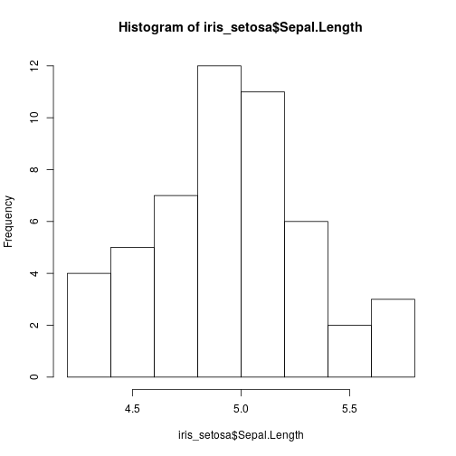
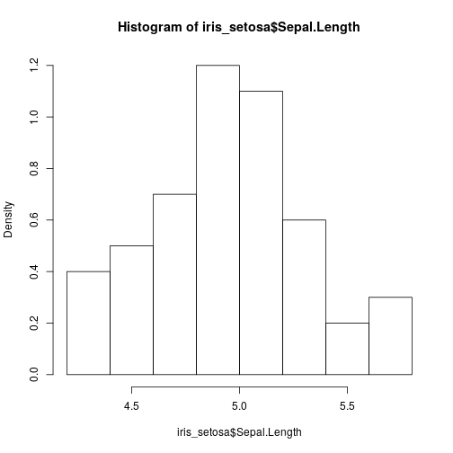
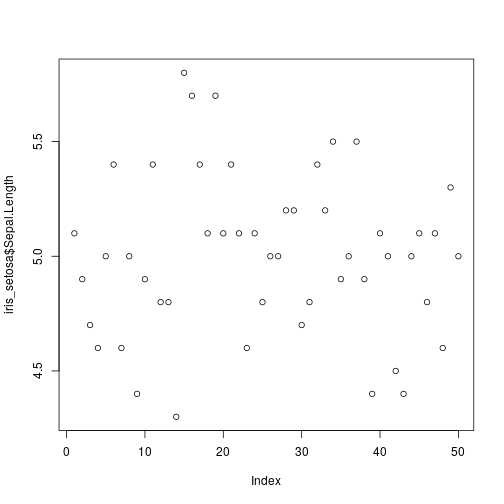
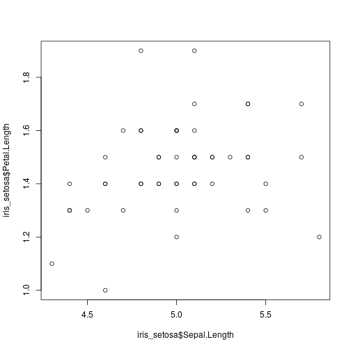
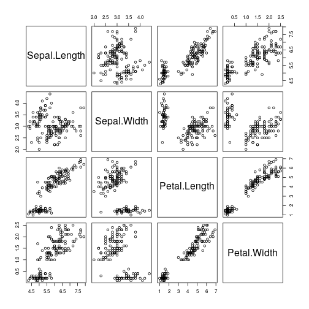
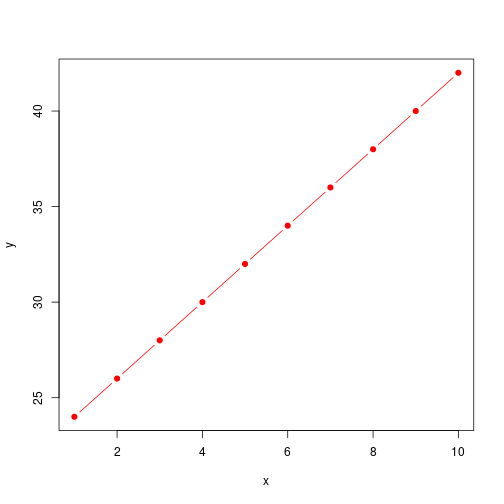
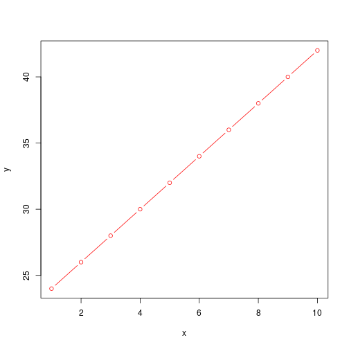
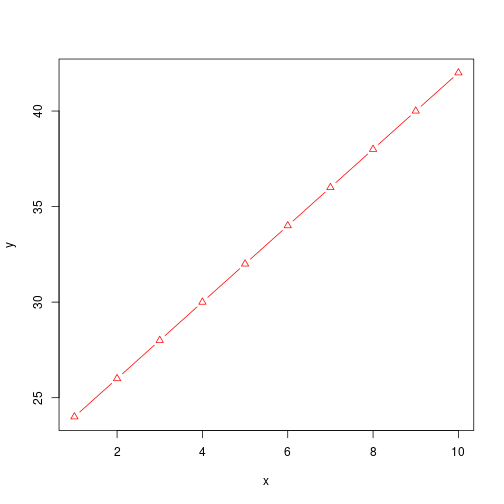
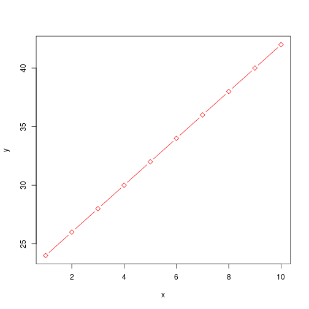

```r
#newhelp(hist)
require(stats)
set.seed(14)
x <- rchisq(100, df = 4)
x
```

```
##   [1]  1.5978282  3.3322985  3.0708725  2.5744330  6.7764815  2.8431800
##   [7]  4.7798098  4.2013360  3.6203090  2.5236530  4.8788430  2.3256201
##  [13] 10.1759434  2.8153700  0.6993601  2.7190979  2.3547836  4.3194835
##  [19]  4.3472164  3.7375415  5.0207279  4.1526903  2.1998894  3.6858705
##  [25]  4.5662583  3.8839883  3.9807882  0.9231033  3.1015811  2.8566852
##  [31]  1.8023261  1.2103736  7.4775292  2.9779815  2.1628704  1.3421543
##  [37]  3.2563822  1.5077376  2.5180166  1.4114212  0.8293910  7.6368595
##  [43] 16.6302925  2.2744868  1.7719876  0.4947304  1.7639663  5.3714693
##  [49]  1.6524618  7.0119613 16.9767672  3.2143291  1.6203122  6.5253462
##  [55]  1.0580171  4.8303820  2.8667919  3.6738743  2.4885080  8.0107460
##  [61]  2.5245266  1.0493424  3.0705241 15.4316212  0.3453903  7.0859825
##  [67]  1.7329998  2.0512795  1.3071472  5.6344011  3.9541127  2.6325437
##  [73]  0.3115387  5.2884788  1.3369640  5.0583443  3.4252851  4.1332816
##  [79]  2.9293921  1.4299040  3.0021506  1.5113295  1.5828157  2.5553601
##  [85]  1.2886474  3.9494644  1.4949560  2.0846314  3.1832552  5.2421299
##  [91]  4.3031409  1.8940315  1.9225727  3.9824388  2.8678671  5.6737469
##  [97] 11.4091608  4.0284655  3.3840483  6.8884167
```

```r
hist(x, freq = FALSE, ylim = c(0, 0.2))
help(hist)
require(stats)
set.seed(14)
x <- rchisq(100, df = 4)
x
```

```
##   [1]  1.5978282  3.3322985  3.0708725  2.5744330  6.7764815  2.8431800
##   [7]  4.7798098  4.2013360  3.6203090  2.5236530  4.8788430  2.3256201
##  [13] 10.1759434  2.8153700  0.6993601  2.7190979  2.3547836  4.3194835
##  [19]  4.3472164  3.7375415  5.0207279  4.1526903  2.1998894  3.6858705
##  [25]  4.5662583  3.8839883  3.9807882  0.9231033  3.1015811  2.8566852
##  [31]  1.8023261  1.2103736  7.4775292  2.9779815  2.1628704  1.3421543
##  [37]  3.2563822  1.5077376  2.5180166  1.4114212  0.8293910  7.6368595
##  [43] 16.6302925  2.2744868  1.7719876  0.4947304  1.7639663  5.3714693
##  [49]  1.6524618  7.0119613 16.9767672  3.2143291  1.6203122  6.5253462
##  [55]  1.0580171  4.8303820  2.8667919  3.6738743  2.4885080  8.0107460
##  [61]  2.5245266  1.0493424  3.0705241 15.4316212  0.3453903  7.0859825
##  [67]  1.7329998  2.0512795  1.3071472  5.6344011  3.9541127  2.6325437
##  [73]  0.3115387  5.2884788  1.3369640  5.0583443  3.4252851  4.1332816
##  [79]  2.9293921  1.4299040  3.0021506  1.5113295  1.5828157  2.5553601
##  [85]  1.2886474  3.9494644  1.4949560  2.0846314  3.1832552  5.2421299
##  [91]  4.3031409  1.8940315  1.9225727  3.9824388  2.8678671  5.6737469
##  [97] 11.4091608  4.0284655  3.3840483  6.8884167
```

```r
hist(x, freq = FALSE, ylim = c(0, 0.2))
```



```r
setwd("~/R_workshop")
```

```
## Error in setwd("~/R_workshop"): cannot change working directory
```

```r
2+2
```

```
## [1] 4
```

```r
3+4
```

```
## [1] 7
```

```r
TRUE
```

```
## [1] TRUE
```

```r
FALSE
```

```
## [1] FALSE
```

```r
T
```

```
## [1] TRUE
```

```r
F
```

```
## [1] FALSE
```

```r
!TRUE
```

```
## [1] FALSE
```

```r
2^1/2
```

```
## [1] 1
```

```r
2^(1/2)
```

```
## [1] 1.414214
```

```r
2^(1/2) * 2^(1/2)
```

```
## [1] 2
```

```r
2^(1/2) * 2^(1/2) - 2
```

```
## [1] 4.440892e-16
```

```r
x=2
x<-2
x<-2
x<-4
weight_kg<-55
weight_kg
```

```
## [1] 55
```

```r
weight_kg<-c(55,65)
weight_kg
```

```
## [1] 55 65
```

```r
x<-1:1000
x
```

```
##    [1]    1    2    3    4    5    6    7    8    9   10   11   12   13
##   [14]   14   15   16   17   18   19   20   21   22   23   24   25   26
##   [27]   27   28   29   30   31   32   33   34   35   36   37   38   39
##   [40]   40   41   42   43   44   45   46   47   48   49   50   51   52
##   [53]   53   54   55   56   57   58   59   60   61   62   63   64   65
##   [66]   66   67   68   69   70   71   72   73   74   75   76   77   78
##   [79]   79   80   81   82   83   84   85   86   87   88   89   90   91
##   [92]   92   93   94   95   96   97   98   99  100  101  102  103  104
##  [105]  105  106  107  108  109  110  111  112  113  114  115  116  117
##  [118]  118  119  120  121  122  123  124  125  126  127  128  129  130
##  [131]  131  132  133  134  135  136  137  138  139  140  141  142  143
##  [144]  144  145  146  147  148  149  150  151  152  153  154  155  156
##  [157]  157  158  159  160  161  162  163  164  165  166  167  168  169
##  [170]  170  171  172  173  174  175  176  177  178  179  180  181  182
##  [183]  183  184  185  186  187  188  189  190  191  192  193  194  195
##  [196]  196  197  198  199  200  201  202  203  204  205  206  207  208
##  [209]  209  210  211  212  213  214  215  216  217  218  219  220  221
##  [222]  222  223  224  225  226  227  228  229  230  231  232  233  234
##  [235]  235  236  237  238  239  240  241  242  243  244  245  246  247
##  [248]  248  249  250  251  252  253  254  255  256  257  258  259  260
##  [261]  261  262  263  264  265  266  267  268  269  270  271  272  273
##  [274]  274  275  276  277  278  279  280  281  282  283  284  285  286
##  [287]  287  288  289  290  291  292  293  294  295  296  297  298  299
##  [300]  300  301  302  303  304  305  306  307  308  309  310  311  312
##  [313]  313  314  315  316  317  318  319  320  321  322  323  324  325
##  [326]  326  327  328  329  330  331  332  333  334  335  336  337  338
##  [339]  339  340  341  342  343  344  345  346  347  348  349  350  351
##  [352]  352  353  354  355  356  357  358  359  360  361  362  363  364
##  [365]  365  366  367  368  369  370  371  372  373  374  375  376  377
##  [378]  378  379  380  381  382  383  384  385  386  387  388  389  390
##  [391]  391  392  393  394  395  396  397  398  399  400  401  402  403
##  [404]  404  405  406  407  408  409  410  411  412  413  414  415  416
##  [417]  417  418  419  420  421  422  423  424  425  426  427  428  429
##  [430]  430  431  432  433  434  435  436  437  438  439  440  441  442
##  [443]  443  444  445  446  447  448  449  450  451  452  453  454  455
##  [456]  456  457  458  459  460  461  462  463  464  465  466  467  468
##  [469]  469  470  471  472  473  474  475  476  477  478  479  480  481
##  [482]  482  483  484  485  486  487  488  489  490  491  492  493  494
##  [495]  495  496  497  498  499  500  501  502  503  504  505  506  507
##  [508]  508  509  510  511  512  513  514  515  516  517  518  519  520
##  [521]  521  522  523  524  525  526  527  528  529  530  531  532  533
##  [534]  534  535  536  537  538  539  540  541  542  543  544  545  546
##  [547]  547  548  549  550  551  552  553  554  555  556  557  558  559
##  [560]  560  561  562  563  564  565  566  567  568  569  570  571  572
##  [573]  573  574  575  576  577  578  579  580  581  582  583  584  585
##  [586]  586  587  588  589  590  591  592  593  594  595  596  597  598
##  [599]  599  600  601  602  603  604  605  606  607  608  609  610  611
##  [612]  612  613  614  615  616  617  618  619  620  621  622  623  624
##  [625]  625  626  627  628  629  630  631  632  633  634  635  636  637
##  [638]  638  639  640  641  642  643  644  645  646  647  648  649  650
##  [651]  651  652  653  654  655  656  657  658  659  660  661  662  663
##  [664]  664  665  666  667  668  669  670  671  672  673  674  675  676
##  [677]  677  678  679  680  681  682  683  684  685  686  687  688  689
##  [690]  690  691  692  693  694  695  696  697  698  699  700  701  702
##  [703]  703  704  705  706  707  708  709  710  711  712  713  714  715
##  [716]  716  717  718  719  720  721  722  723  724  725  726  727  728
##  [729]  729  730  731  732  733  734  735  736  737  738  739  740  741
##  [742]  742  743  744  745  746  747  748  749  750  751  752  753  754
##  [755]  755  756  757  758  759  760  761  762  763  764  765  766  767
##  [768]  768  769  770  771  772  773  774  775  776  777  778  779  780
##  [781]  781  782  783  784  785  786  787  788  789  790  791  792  793
##  [794]  794  795  796  797  798  799  800  801  802  803  804  805  806
##  [807]  807  808  809  810  811  812  813  814  815  816  817  818  819
##  [820]  820  821  822  823  824  825  826  827  828  829  830  831  832
##  [833]  833  834  835  836  837  838  839  840  841  842  843  844  845
##  [846]  846  847  848  849  850  851  852  853  854  855  856  857  858
##  [859]  859  860  861  862  863  864  865  866  867  868  869  870  871
##  [872]  872  873  874  875  876  877  878  879  880  881  882  883  884
##  [885]  885  886  887  888  889  890  891  892  893  894  895  896  897
##  [898]  898  899  900  901  902  903  904  905  906  907  908  909  910
##  [911]  911  912  913  914  915  916  917  918  919  920  921  922  923
##  [924]  924  925  926  927  928  929  930  931  932  933  934  935  936
##  [937]  937  938  939  940  941  942  943  944  945  946  947  948  949
##  [950]  950  951  952  953  954  955  956  957  958  959  960  961  962
##  [963]  963  964  965  966  967  968  969  970  971  972  973  974  975
##  [976]  976  977  978  979  980  981  982  983  984  985  986  987  988
##  [989]  989  990  991  992  993  994  995  996  997  998  999 1000
```

```r
1:10
```

```
##  [1]  1  2  3  4  5  6  7  8  9 10
```

```r
x<-1:10
x
```

```
##  [1]  1  2  3  4  5  6  7  8  9 10
```

```r
x
```

```
##  [1]  1  2  3  4  5  6  7  8  9 10
```

```r
x*2.5
```

```
##  [1]  2.5  5.0  7.5 10.0 12.5 15.0 17.5 20.0 22.5 25.0
```

```r
mass=47.5
age=122
2/3
```

```
## [1] 0.6666667
```

```r
mass/age
```

```
## [1] 0.3893443
```

```r
mass
```

```
## [1] 47.5
```

```r
age
```

```
## [1] 122
```

```r
c(12,13,567,23)
```

```
## [1]  12  13 567  23
```

```r
c("mouse","cat","dog")
```

```
## [1] "mouse" "cat"   "dog"
```

```r
c(12,13,567,23,2.5)
```

```
## [1]  12.0  13.0 567.0  23.0   2.5
```

```r
animals<-c("mouse","cat","dog")
length(animals)
```

```
## [1] 3
```

```r
class(animals)
```

```
## [1] "character"
```

```r
class(x)
```

```
## [1] "integer"
```

```r
str(animals)
```

```
##  chr [1:3] "mouse" "cat" "dog"
```

```r
c(1,2,"a",T)
```

```
## [1] "1"    "2"    "a"    "TRUE"
```

```r
animals
```

```
## [1] "mouse" "cat"   "dog"
```

```r
animals[1]
```

```
## [1] "mouse"
```

```r
animals[3]
```

```
## [1] "dog"
```

```r
animals[4]
```

```
## [1] NA
```

```r
c(1,2)
```

```
## [1] 1 2
```

```r
animals[c(1,2)]
```

```
## [1] "mouse" "cat"
```

```r
weight_kg<-c(34,50,43,87,56,98)
weight_kg
```

```
## [1] 34 50 43 87 56 98
```

```r
weight_kg>50
```

```
## [1] FALSE FALSE FALSE  TRUE  TRUE  TRUE
```

```r
weight_kg[weight_kg>50]
```

```
## [1] 87 56 98
```

```r
1:10
```

```
##  [1]  1  2  3  4  5  6  7  8  9 10
```

```r
?seq
seq(1,10,1)
```

```
##  [1]  1  2  3  4  5  6  7  8  9 10
```

```r
seq(from=1,to=10,by=3)
```

```
## [1]  1  4  7 10
```

```r
c(1,1,1,1,1)
```

```
## [1] 1 1 1 1 1
```

```r
rep(1,10)
```

```
##  [1] 1 1 1 1 1 1 1 1 1 1
```

```r
rep_x<-rep(1,10)
x<-1:10
y<-2*c(12:22)
length(y)
```

```
## [1] 11
```

```r
y<-2*c(12:21)
length(y)
```

```
## [1] 10
```

```r
length(x)
```

```
## [1] 10
```

```r
?plot
plot(x=x,y=y)
```



```r
plot(x=x,y=y,"b")
```



```r
plot(x=x,y=y,type="b")
plot(x=x,y=y,type="n")
```



```r
plot(x=x,y=y,type="b",col="red")
```



```r
plot(x=x,y=y,type="b",col="red",pch=19)
```



```r
plot(x=x,y=y,type="b",col="red",pch=1)
```



```r
plot(x=x,y=y,type="b",col="red",pch=2)
```



```r
plot(x=x,y=y,type="b",col="red",pch=5)
```



