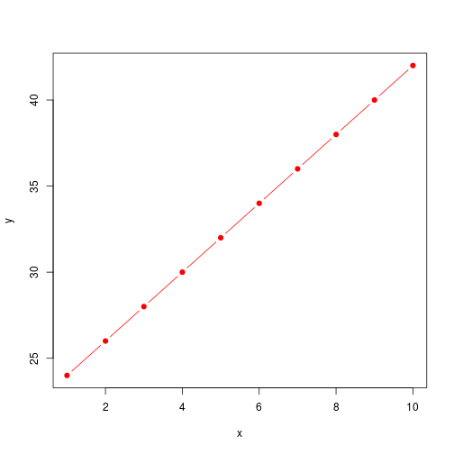
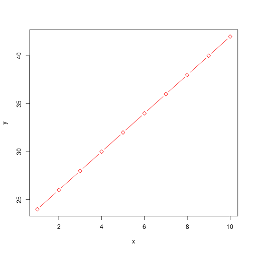

```r
# read csv file in R
data1=read.csv("ageandheight.csv")
data1
```

```
##    age height no_siblings
## 1   18  76.10           1
## 2   19  77.00           2
## 3   20  78.10           4
## 4   21  78.20           5
## 5   22  78.80           3
## 6   23  79.70           2
## 7   24   7.99           3
## 8   25  81.10           2
## 9   26  81.20           3
## 10  27  81.80           2
## 11  28  82.80           1
## 12  29  83.50           1
```

```r
head(data1,2)
```

```
##   age height no_siblings
## 1  18   76.1           1
## 2  19   77.0           2
```

```r
tail(data1,2)
```

```
##    age height no_siblings
## 11  28   82.8           1
## 12  29   83.5           1
```

```r
# check if dataframe
class(data1)
```

```
## [1] "data.frame"
```

```r
# exploratory analysis

# check for dimensions
dim(data1)
```

```
## [1] 12  3
```

```r
nrow(data1)
```

```
## [1] 12
```

```r
ncol(data1)
```

```
## [1] 3
```

```r
#column names
colnames(data1)
```

```
## [1] "age"         "height"      "no_siblings"
```

```r
#extract one column
data1$no_siblings
```

```
##  [1] 1 2 4 5 3 2 3 2 3 2 1 1
```

```r
class(data1$no_siblings)
```

```
## [1] "integer"
```

```r
class(data1$age)
```

```
## [1] "integer"
```

```r
for(i in 1:ncol(data1)){
  print(i)
  print(class(data1[,i]))
  
}
```

```
## [1] 1
## [1] "integer"
## [1] 2
## [1] "numeric"
## [1] 3
## [1] "integer"
```

```r
# distribution
hist(data1$height)
```


```r
hist(data1$age)
```


```r
# outliers
boxplot(data1$height)
```


```r
boxplot(data1$age)
```


```r
# remove outlier
data1=data1[-which(data1$height<20), ]

# check for na
which(is.na(data1$height))
```

```
## integer(0)
```

```r
# relationship
plot(x=data1$age,y=data1$height)
```


```r
plot(data1$age,data1$no_siblings)
```



```r
plot(data1$age,data1$height)


# linear model
model=lm(height~age,data=data1)
model$coefficients
```

```
## (Intercept)         age 
##  64.9286624   0.6359873
```

```r
coef(model)
```

```
## (Intercept)         age 
##  64.9286624   0.6359873
```

```r
intercept=coef(model)[1]
slope=coef(model)[2]


plot(data1$age,data1$height)
abline(a=intercept,b=slope,col="red")
```


```r
cor(data1$age,data1$height)
```

```
## [1] 0.99504
```

```r
# structure of model

str(model)
```

```
## List of 12
##  $ coefficients : Named num [1:2] 64.929 0.636
##   ..- attr(*, "names")= chr [1:2] "(Intercept)" "age"
##  $ residuals    : Named num [1:11] -0.2764 -0.0124 0.4516 -0.0844 -0.1204 ...
##   ..- attr(*, "names")= chr [1:11] "1" "2" "3" "4" ...
##  $ effects      : Named num [1:11] -264.8174 7.598 0.5082 -0.0244 -0.057 ...
##   ..- attr(*, "names")= chr [1:11] "(Intercept)" "age" "" "" ...
##  $ rank         : int 2
##  $ fitted.values: Named num [1:11] 76.4 77 77.6 78.3 78.9 ...
##   ..- attr(*, "names")= chr [1:11] "1" "2" "3" "4" ...
##  $ assign       : int [1:2] 0 1
##  $ qr           :List of 5
##   ..$ qr   : num [1:11, 1:2] -3.317 0.302 0.302 0.302 0.302 ...
##   .. ..- attr(*, "dimnames")=List of 2
##   .. .. ..$ : chr [1:11] "1" "2" "3" "4" ...
##   .. .. ..$ : chr [1:2] "(Intercept)" "age"
##   .. ..- attr(*, "assign")= int [1:2] 0 1
##   ..$ qraux: num [1:2] 1.3 1.27
##   ..$ pivot: int [1:2] 1 2
##   ..$ tol  : num 1e-07
##   ..$ rank : int 2
##   ..- attr(*, "class")= chr "qr"
##  $ df.residual  : int 9
##  $ xlevels      : Named list()
##  $ call         : language lm(formula = height ~ age, data = data1)
##  $ terms        :Classes 'terms', 'formula'  language height ~ age
##   .. ..- attr(*, "variables")= language list(height, age)
##   .. ..- attr(*, "factors")= int [1:2, 1] 0 1
##   .. .. ..- attr(*, "dimnames")=List of 2
##   .. .. .. ..$ : chr [1:2] "height" "age"
##   .. .. .. ..$ : chr "age"
##   .. ..- attr(*, "term.labels")= chr "age"
##   .. ..- attr(*, "order")= int 1
##   .. ..- attr(*, "intercept")= int 1
##   .. ..- attr(*, "response")= int 1
##   .. ..- attr(*, ".Environment")=<environment: R_GlobalEnv> 
##   .. ..- attr(*, "predvars")= language list(height, age)
##   .. ..- attr(*, "dataClasses")= Named chr [1:2] "numeric" "numeric"
##   .. .. ..- attr(*, "names")= chr [1:2] "height" "age"
##  $ model        :'data.frame':	11 obs. of  2 variables:
##   ..$ height: num [1:11] 76.1 77 78.1 78.2 78.8 79.7 81.1 81.2 81.8 82.8 ...
##   ..$ age   : int [1:11] 18 19 20 21 22 23 25 26 27 28 ...
##   ..- attr(*, "terms")=Classes 'terms', 'formula'  language height ~ age
##   .. .. ..- attr(*, "variables")= language list(height, age)
##   .. .. ..- attr(*, "factors")= int [1:2, 1] 0 1
##   .. .. .. ..- attr(*, "dimnames")=List of 2
##   .. .. .. .. ..$ : chr [1:2] "height" "age"
##   .. .. .. .. ..$ : chr "age"
##   .. .. ..- attr(*, "term.labels")= chr "age"
##   .. .. ..- attr(*, "order")= int 1
##   .. .. ..- attr(*, "intercept")= int 1
##   .. .. ..- attr(*, "response")= int 1
##   .. .. ..- attr(*, ".Environment")=<environment: R_GlobalEnv> 
##   .. .. ..- attr(*, "predvars")= language list(height, age)
##   .. .. ..- attr(*, "dataClasses")= Named chr [1:2] "numeric" "numeric"
##   .. .. .. ..- attr(*, "names")= chr [1:2] "height" "age"
##  - attr(*, "class")= chr "lm"
```

```r
summary(model)
```

```
## 
## Call:
## lm(formula = height ~ age, data = data1)
## 
## Residuals:
##      Min       1Q   Median       3Q      Max 
## -0.30032 -0.19236 -0.01242  0.13567  0.45159 
## 
## Coefficients:
##             Estimate Std. Error t value Pr(>|t|)    
## (Intercept) 64.92866    0.50291  129.10 5.10e-16 ***
## age          0.63599    0.02119   30.01 2.48e-10 ***
## ---
## Signif. codes:  0 '***' 0.001 '**' 0.01 '*' 0.05 '.' 0.1 ' ' 1
## 
## Residual standard error: 0.2532 on 9 degrees of freedom
## Multiple R-squared:  0.9901,	Adjusted R-squared:  0.989 
## F-statistic: 900.5 on 1 and 9 DF,  p-value: 2.477e-10
```

```r
plot(model$residuals)
```


```r
# predict on new data
new=data.frame(age=c(25,21,23))
predict(model,new)
```

```
##        1        2        3 
## 80.82834 78.28439 79.55637
```

```r
#multiple regression
model=lm(height~age+no_siblings,data=data1)

##

model=lm(height~age+no_siblings,data=data1)
new=data.frame(age=c(25,21,23),no_siblings=c(2,1,0))
predict(model,new)
```

```
##        1        2        3 
## 80.82417 78.24354 79.49716
```

```r
# packages

install.packages("mlbench")
```

```
## Installing package into '/home/disha/R/x86_64-pc-linux-gnu-library/3.6'
## (as 'lib' is unspecified)
```

```r
library(mlbench)

data("BostonHousing")


#load data
data("BostonHousing")

head(BostonHousing)
```

```
##      crim zn indus chas   nox    rm  age    dis rad tax ptratio      b
## 1 0.00632 18  2.31    0 0.538 6.575 65.2 4.0900   1 296    15.3 396.90
## 2 0.02731  0  7.07    0 0.469 6.421 78.9 4.9671   2 242    17.8 396.90
## 3 0.02729  0  7.07    0 0.469 7.185 61.1 4.9671   2 242    17.8 392.83
## 4 0.03237  0  2.18    0 0.458 6.998 45.8 6.0622   3 222    18.7 394.63
## 5 0.06905  0  2.18    0 0.458 7.147 54.2 6.0622   3 222    18.7 396.90
## 6 0.02985  0  2.18    0 0.458 6.430 58.7 6.0622   3 222    18.7 394.12
##   lstat medv
## 1  4.98 24.0
## 2  9.14 21.6
## 3  4.03 34.7
## 4  2.94 33.4
## 5  5.33 36.2
## 6  5.21 28.7
```

```r
#rename data
boston=BostonHousing

cols=colnames(boston)
classes=c()
for(i in 1:length(cols)){
  #print(i)
  classes[i]=class(boston[,i])
}


cols[which(classes=="factor")]
```

```
## [1] "chas"
```

```r
pairs(boston[,c(10:13,14)])
```



```r
plot(boston$medv,
     col=c("red","blue")[boston$chas])
```


```r
#legend()


pairs(boston[ ,c(11:13,14)],
      col=c("red","blue")[boston$chas])
```


```r
#dist
hist(boston$rm,freq =F)
lines(density(boston$rm))
```


```r
summary(boston$rm)
```

```
##    Min. 1st Qu.  Median    Mean 3rd Qu.    Max. 
##   3.561   5.886   6.208   6.285   6.623   8.780
```

```r
which(is.na(boston$rm)==TRUE)
```

```
## integer(0)
```

```r
boxplot(boston$rm)
```


```r
linear=lm(medv~rm,data=boston)

plot(x=(boston$rm),y=boston$medv)
abline(a=coef(linear)[1],b=coef(linear)[2],
       col="red")
```


```r
summary(linear)
```

```
## 
## Call:
## lm(formula = medv ~ rm, data = boston)
## 
## Residuals:
##     Min      1Q  Median      3Q     Max 
## -23.346  -2.547   0.090   2.986  39.433 
## 
## Coefficients:
##             Estimate Std. Error t value Pr(>|t|)    
## (Intercept)  -34.671      2.650  -13.08   <2e-16 ***
## rm             9.102      0.419   21.72   <2e-16 ***
## ---
## Signif. codes:  0 '***' 0.001 '**' 0.01 '*' 0.05 '.' 0.1 ' ' 1
## 
## Residual standard error: 6.616 on 504 degrees of freedom
## Multiple R-squared:  0.4835,	Adjusted R-squared:  0.4825 
## F-statistic: 471.8 on 1 and 504 DF,  p-value: < 2.2e-16
```

```r
plot(linear$residuals)
```


```r
linear=lm(medv~ lstat+rm  ,data=boston)


# nonlinaer polynomial fit

nl =  lm(medv~poly(lstat,2,raw=T),data=boston)
nl
```

```
## 
## Call:
## lm(formula = medv ~ poly(lstat, 2, raw = T), data = boston)
## 
## Coefficients:
##              (Intercept)  poly(lstat, 2, raw = T)1  
##                 42.86201                  -2.33282  
## poly(lstat, 2, raw = T)2  
##                  0.04355
```

```r
fitted_values = nl$coefficients[1] +
                nl$coefficients[2] * boston$lstat +
                nl$coefficients[3] * (boston$lstat)^2

plot(boston$lstat,boston$medv)

lines((boston$lstat),
      fitted_values,
      col="red")

lines(sort(boston$lstat),
      fitted_values[order(boston$lstat)],
      col="red")
```


```r
#new data

library(mlbench)

# load the data
data("Loblolly")
#print data
Loblolly
```

```
##    height age Seed
## 1    4.51   3  301
## 15  10.89   5  301
## 29  28.72  10  301
## 43  41.74  15  301
## 57  52.70  20  301
## 71  60.92  25  301
## 2    4.55   3  303
## 16  10.92   5  303
## 30  29.07  10  303
## 44  42.83  15  303
## 58  53.88  20  303
## 72  63.39  25  303
## 3    4.79   3  305
## 17  11.37   5  305
## 31  30.21  10  305
## 45  44.40  15  305
## 59  55.82  20  305
## 73  64.10  25  305
## 4    3.91   3  307
## 18   9.48   5  307
## 32  25.66  10  307
## 46  39.07  15  307
## 60  50.78  20  307
## 74  59.07  25  307
## 5    4.81   3  309
## 19  11.20   5  309
## 33  28.66  10  309
## 47  41.66  15  309
## 61  53.31  20  309
## 75  63.05  25  309
## 6    3.88   3  311
## 20   9.40   5  311
## 34  25.99  10  311
## 48  39.55  15  311
## 62  51.46  20  311
## 76  59.64  25  311
## 7    4.32   3  315
## 21  10.43   5  315
## 35  27.16  10  315
## 49  40.85  15  315
## 63  51.33  20  315
## 77  60.07  25  315
## 8    4.57   3  319
## 22  10.57   5  319
## 36  27.90  10  319
## 50  41.13  15  319
## 64  52.43  20  319
## 78  60.69  25  319
## 9    3.77   3  321
## 23   9.03   5  321
## 37  25.45  10  321
## 51  38.98  15  321
## 65  49.76  20  321
## 79  60.28  25  321
## 10   4.33   3  323
## 24  10.79   5  323
## 38  28.97  10  323
## 52  42.44  15  323
## 66  53.17  20  323
## 80  61.62  25  323
## 11   4.38   3  325
## 25  10.48   5  325
## 39  27.93  10  325
## 53  40.20  15  325
## 67  50.06  20  325
## 81  58.49  25  325
## 12   4.12   3  327
## 26   9.92   5  327
## 40  26.54  10  327
## 54  37.82  15  327
## 68  48.43  20  327
## 82  56.81  25  327
## 13   3.93   3  329
## 27   9.34   5  329
## 41  26.08  10  329
## 55  37.79  15  329
## 69  48.31  20  329
## 83  56.43  25  329
## 14   3.46   3  331
## 28   9.05   5  331
## 42  25.85  10  331
## 56  39.15  15  331
## 70  49.12  20  331
## 84  59.49  25  331
```

```r
# view data
View(Loblolly)
# look at the documentation

?Loblolly

# Exploratoey analysis

# dimensions
dim(Loblolly)
```

```
## [1] 84  3
```

```r
row_L=dim(Loblolly)[1]
col_L=dim(Loblolly)[2]
# column names
colnames()
```

```
## Error in is.data.frame(x): argument "x" is missing, with no default
```

```r
# check class of the variables
class(Loblolly$Seed)
```

```
## [1] "ordered" "factor"
```

```r
# histogram for distribution
hist(Loblolly$height,breaks=10,
     main="distribution of height of trees",
     xlab = "height",
     ylab = "Frequency",
     col="magenta")
```


```r
# boxplot outliers
boxplot(Loblolly$height,
        col="coral",
        main="boxplot for height")
```


```r
# check if na values
is.na(Loblolly$height)
```

```
##  [1] FALSE FALSE FALSE FALSE FALSE FALSE FALSE FALSE FALSE FALSE FALSE
## [12] FALSE FALSE FALSE FALSE FALSE FALSE FALSE FALSE FALSE FALSE FALSE
## [23] FALSE FALSE FALSE FALSE FALSE FALSE FALSE FALSE FALSE FALSE FALSE
## [34] FALSE FALSE FALSE FALSE FALSE FALSE FALSE FALSE FALSE FALSE FALSE
## [45] FALSE FALSE FALSE FALSE FALSE FALSE FALSE FALSE FALSE FALSE FALSE
## [56] FALSE FALSE FALSE FALSE FALSE FALSE FALSE FALSE FALSE FALSE FALSE
## [67] FALSE FALSE FALSE FALSE FALSE FALSE FALSE FALSE FALSE FALSE FALSE
## [78] FALSE FALSE FALSE FALSE FALSE FALSE FALSE
```

```r
which(is.na(Loblolly$height) == T)
```

```
## integer(0)
```

```r
# calculate stats functions

mean()
```

```
## Error in mean.default(): argument "x" is missing, with no default
```

```r
sd()
```

```
## Error in is.vector(x): argument "x" is missing, with no default
```

```r
var()
```

```
## Error in is.data.frame(x): argument "x" is missing, with no default
```

```r
max()
```

```
## Warning in max(): no non-missing arguments to max; returning -Inf
```

```
## [1] -Inf
```

```r
min()
```

```
## Warning in min(): no non-missing arguments to min; returning Inf
```

```
## [1] Inf
```

```r
summary()
```

```
## Error in is.factor(object): argument "object" is missing, with no default
```

```r
#see factor levels
levels(Loblolly$Seed)
```

```
##  [1] "329" "327" "325" "307" "331" "311" "315" "321" "319" "301" "323"
## [12] "309" "303" "305"
```

```r
# plot the scatter plot
plot(Loblolly$height,
     Loblolly$age,
     col=c(1:14)[unclass(Loblolly$Seed)],
     xlab="Height",
     ylab="age",
     main="doesn't matter where the seed comes from...
     as age increases height increase")
```


```r
#
```

