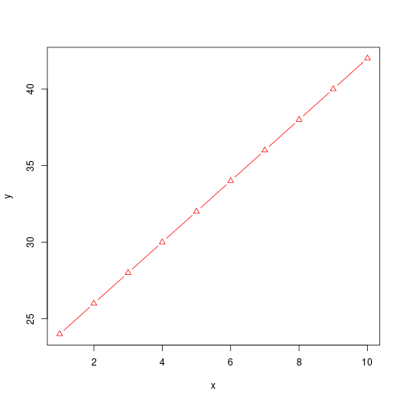

```r
#read file

data=read.csv("ageandheight.csv")

dim(data)
```

```
## [1] 12  3
```

```r
boxplot(data$age)
```


```r
boxplot(data$height)
```


```r
hist(data$height,freq = F)
```


```r
plot(density(data$height))
```


```r
data=data[-which(data$height<20),]

# model

linear_Model=lm(height~age,data=data)

linear_Model$coefficients
```

```
## (Intercept)         age 
##  64.9286624   0.6359873
```

```r
plot(data$age,data$height)
abline(a=linear_Model$coefficients[1],b=linear_Model$coefficients[2])
```


```r
plot(linear_Model$residuals)
```


```r
new=data.frame(age=c(22,36,29))
predict(linear_Model,new)
```

```
##        1        2        3 
## 78.92038 87.82420 83.37229
```

```r
#
install.packages("mlbench")
```

```
## Error in install.packages : Updating loaded packages
```

```r
library(mlbench)
library(help = "mlbench")

boston=BostonHousing

?BostonHousing

plot(boston$medv,boston$rm)
```


```r
pairs(boston[,c(10:13,14)])
```



```r
write.csv(boston,"boston.csv")
```

